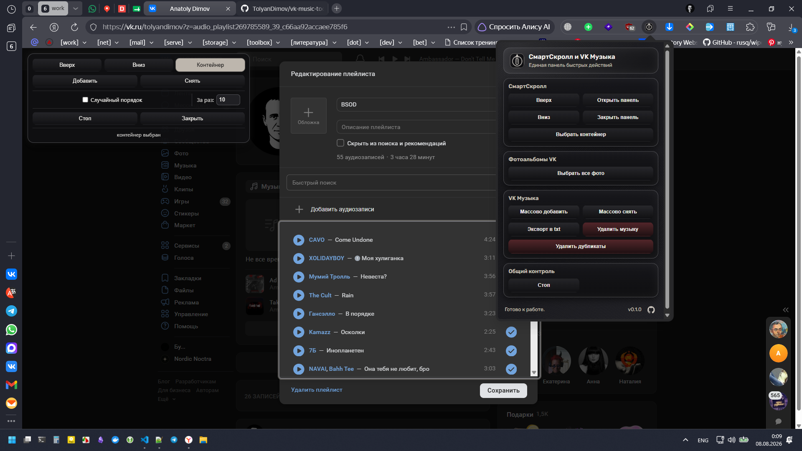

# SmartScroll & VK Musik

[English](README.md) · [Русский](README_RU.md) · [Deutsch](README_DE.md)

Die Erweiterung kombiniert SmartScroll und Tools für VK Musik-Playlists.
Erstellt aus älteren [Snippets](https://github.com/TolyanDimov/Snippets), die über F12 in [DevTools](https://developer.chrome.com/docs/devtools/console/javascript?hl=en) genutzt wurden.

## Funktionen

- **SmartScroll:** Auto-Scroll hoch/runter, Container-Auswahl, schwebendes Bedienfeld.
- **VK Musik:** Massen-Hinzufügen/Entfernen im Playlist-Bearbeitungsmodus, geladene Tracks und sichere Duplikate aus der Musik löschen.
- **Export:** Trackliste als TXT (`Künstler - Titel`).

## Lokalisierungsunterstützung

Die Erweiterung unterstützt drei Sprachen: Russisch, Englisch und Deutsch.

## Installation (Entwicklermodus)

1. Öffne `chrome://extensions/` in der Adressleiste.
2. Entwicklermodus aktivieren.
3. **Entpackte Erweiterung laden** und den Ordner `vk-music-tools-ext` wählen.

## Nutzung

### SmartScroll

1. **Panel öffnen** im Popup.
2. Das Panel bietet **Hoch**, **Runter**, **Wählen** (Container), **Stopp**, **Schließen**.

### VK Musik

1. VK Musik öffnen und Playlist-Bearbeitung starten.
2. **Zuerst bis zum Ende scrollen** (SmartScroll verwenden).
3. Schwebendes Panel: **Hinzufügen**, **Entfernen**, **Stopp** (alle Vorgänge beenden).
4. Fortschritt wird in der Statuszeile des Panels angezeigt.

### Export

1. Playlist oder VK Musik öffnen.
2. **Zuerst bis zum Ende scrollen** (SmartScroll verwenden).
3. **Export nach TXT** im Popup.

### Musik Löschen

1. VK Musik mit einer Trackliste öffnen.
2. **Zuerst bis zum Ende scrollen** (SmartScroll verwenden).
3. **Musik löschen** im Popup drücken und die Aktion bestätigen.
4. Anzahl der zu löschenden Tracks eingeben oder leer lassen, um alle gefundenen Tracks zu löschen.
5. Der Löschfortschritt wird im SmartScroll-Panel angezeigt.

### Duplikate Löschen

1. VK Musik mit einer Trackliste öffnen.
2. **Zuerst bis zum Ende scrollen** (SmartScroll verwenden).
3. **Duplikate löschen** im Popup drücken und die Aktion bestätigen.
4. Ein sicheres Duplikat hat denselben Titel und dieselbe Dauer.

## Hinweise

- Playlist-Hinzufügen/Entfernen funktioniert nur in der Playlist-Bearbeitung.
- Löschen arbeitet mit den auf der Seite geladenen Tracks und fragt vor dem Start nach Bestätigung.
- Tab während der Ausführung nicht schließen.
- Große Playlists können den Browser verlangsamen.

## Lizenzen

- Rubik-Schrift: `assets/fonts/OFL.txt`.

## Autor

Anatoly Dimov — https://github.com/TolyanDimov

**Lokalisierungsunterstützung**

**Die Erweiterung**unterstützt**drei**Sprachen**: Russisch**, Englisch und Deutsch.

