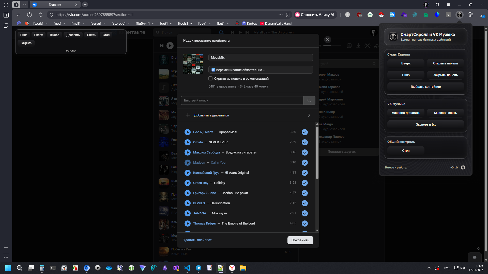

# СмартСкролл и VK Музыка

[English](README.md) · [Русский](README_RU.md) · [Deutsch](README_DE.md)

Расширение объединяет универсальный СмартСкролл и инструменты для работы с плейлистами VK Музыки.
Собрано из старых [снипетов](https://github.com/TolyanDimov/Snippets), которые использовал через F12 в [DevTools](https://developer.chrome.com/docs/devtools/console/javascript?hl=en).

## Возможности

- **СмартСкролл:** автопрокрутка вверх/вниз, выбор контейнера, управление с плавающей панели.
- **VK Музыка:** массовое добавление/снятие треков в режиме редактирования плейлиста.
- **Экспорт:** сохранение списка треков в TXT (формат `Исполнитель - Название`).

## Поддержка локализации

Расширение поддерживает три языка: русский, английский и немецкий.

## Поддержка локализации

Расширение поддерживает три языка: русский, английский и немецкий.
Popup и manifest используют язык интерфейса Chrome и `default_locale`. Плавающая панель СмартСкролла использует `navigator.language`.

## Установка (режим разработчика)

1. Откройте в адресной строке браузера `chrome://extensions/`.
2. Включите режим разработчика.
3. Нажмите **Загрузить распакованную** папку `vk-music-tools-ext`.

## Как пользоваться

### СмартСкролл

1. Нажмите **Открыть панель** в popup.
2. В панели доступны кнопки **Вверх**, **Вниз**, **Выбор** (контейнера), **Стоп**, **Закрыть**.

### VK Музыка

1. Откройте VK Музыку и перейдите в редактирование плейлиста.
2. **Сначала прокрутите список до конца** (можно СмартСкроллом).
3. Используйте плавающую панель: **Добавить** треки, **Снять** треки, **Стоп** (прервать все операции).
4. Прогресс отображается в строке статуса плавающей панели.

### Экспорт

1. Откройте плейлист или раздел Музыки VK.
2. **Сначала прокрутите список до конца** (можно СмартСкроллом).
3. Нажмите **Экспорт в txt** в popup.

## Примечания

- Кнопки VK доступны только при открытом редактировании плейлиста.
- Для стабильной работы не закрывайте вкладку во время выполнения операций.
- В больших плейлистах возможны зависания браузера.

## Лицензии

- Шрифт Rubik: `assets/fonts/OFL.txt`.

## Автор

Anatoly Dimov — https://github.com/TolyanDimov

