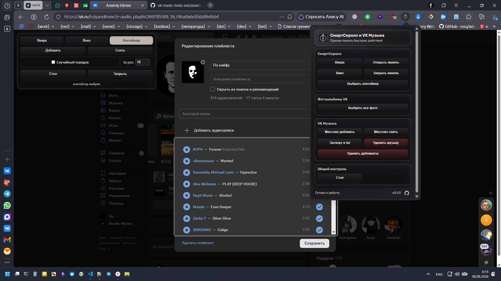

# СмартСкролл и VK Музыка

[English](README.md) · [Русский](README_RU.md) · [Deutsch](README_DE.md)

Расширение объединяет универсальный СмартСкролл и инструменты для работы с плейлистами VK Музыки.
Собрано из старых [снипетов](https://github.com/TolyanDimov/Snippets), которые использовал через F12 в [DevTools](https://developer.chrome.com/docs/devtools/console/javascript?hl=en).

## Возможности

- **СмартСкролл:** плавная автопрокрутка вверх/вниз с небольшими вариациями шага и паузы, выбор контейнера, управление с плавающей панели и повторная активация подгрузки внизу списка.
- **VK Музыка:** массовое добавление/снятие треков в режиме редактирования плейлиста, выбор количества за один пакет (1–100), случайный выбор треков, удаление загруженных треков и безопасных дубликатов из музыки.
- **Фотоальбомы VK:** массовый выбор всех фотографий штатной кнопкой VK для последующего переноса через меню **Ещё**.
- **Экспорт:** сохранение списка треков в TXT (формат `Исполнитель - Название`).

## Поддержка локализации

Расширение поддерживает три языка: русский, английский и немецкий.

## Установка (режим разработчика)

1. Откройте в адресной строке браузера `chrome://extensions/`.
2. Включите режим разработчика.
3. Нажмите **Загрузить распакованную** папку `vk-music-tools-ext`.

## Как пользоваться

### СмартСкролл

1. Нажмите **Открыть панель** в popup.
2. В панели доступны кнопки **Вверх**, **Вниз**, **Контейнер**, **Стоп**, **Закрыть** и **Экспорт TXT**.
3. Включите чекбокс **Плавность прокрутки**, если нужна текущая плавная прокрутка с паузами. Если чекбокс выключен, используется быстрый режим.

### VK Музыка

1. Откройте VK Музыку и перейдите в редактирование плейлиста.
2. **Сначала прокрутите список до конца** (можно СмартСкроллом).
3. Нажмите **Добавить** и укажите количество треков. Пустое значение добавит все найденные треки.
4. Чтобы выбирать треки случайно, включите чекбокс **Случайный порядок** перед запуском.
5. В поле **За раз** укажите размер пакета от 1 до 100. Без случайного режима добавление начинается с нижних доступных треков.
6. Для снятия используйте **Снять**, а для остановки операции — **Стоп**.
7. Прогресс отображается в строке статуса плавающей панели.

Чтобы добавить треки из экспортированного списка:

1. В режиме редактирования нажмите **Добавить из TXT**.
2. Выберите TXT-файл, созданный кнопкой **Экспорт TXT**.
3. Треки будут сопоставлены по формату `Исполнитель - Название` и отмечены в обратном порядке строк файла: последняя строка — первой.

Если у трека несколько исполнителей, экспорт сохраняет их всех, например `HENSEI, Ambassador - IMMORTAL`. Старые файлы с одним исполнителем также поддерживаются.

Перед импортом загрузите нужные треки на странице плейлиста прокруткой до конца, чтобы VK отобразил их в списке.

Из плавающей панели доступны **Добавить**, **Из файла** и **Снять**. Кнопка **Из файла** также запускает импорт TXT в обратном порядке строк.

### Перенос фотографий между альбомами VK

1. Откройте нужный альбом VK и включите режим выбора фотографий.
2. Нажмите **Выбрать все фото** в popup расширения.
3. В VK откройте **Ещё** и выберите перенос в другой альбом.

Расширение нажимает штатную кнопку VK **Выбрать все**, поэтому доступность переноса определяется правами аккаунта и текущей версией интерфейса VK.

### Экспорт

1. Откройте плейлист или раздел Музыки VK.
2. **Сначала прокрутите список до конца** (можно СмартСкроллом).
3. Нажмите **Экспорт TXT** в popup.

При запуске экспорта из плавающей панели используется выбранный через **Контейнер** список; другие списки на странице в файл не попадают.

### Удаление музыки

1. Откройте раздел Музыки VK со списком треков.
2. **Сначала прокрутите список до конца** (можно СмартСкроллом).
3. Нажмите **Удалить музыку** в popup, укажите количество и пройдите два подробных предупреждения.
4. Укажите количество треков для удаления или оставьте поле пустым, чтобы удалить все найденные.
5. Прогресс удаления отображается в панели СмартСкролла.

### Удаление дубликатов

1. Откройте раздел Музыки VK со списком треков.
2. **Сначала прокрутите список до конца** (можно СмартСкроллом).
3. Нажмите **Удалить дубликаты** в popup и пройдите два подробных предупреждения.
4. Безопасным дубликатом считается трек с тем же названием и длительностью.

## Примечания

- Добавление и снятие галочек доступны в режиме редактирования плейлиста.
- Поддерживаются адреса VK `vk.com` и `vk.ru`.
- Удаление работает с загруженными на странице треками; в новом интерфейсе VK используются штатные кнопки удаления треков.
- Удаление требует двух подтверждений и не может быть автоматически отменено.
- Если VK задерживает подгрузку внизу списка, СмартСкролл автоматически поднимается на несколько песен и возвращается вниз.
- Для стабильной работы не закрывайте вкладку во время выполнения операций.
- В больших плейлистах возможны зависания браузера.

## Лицензии

- Шрифт Rubik: `assets/fonts/OFL.txt`.

## Автор

Anatoly Dimov — https://github.com/TolyanDimov
